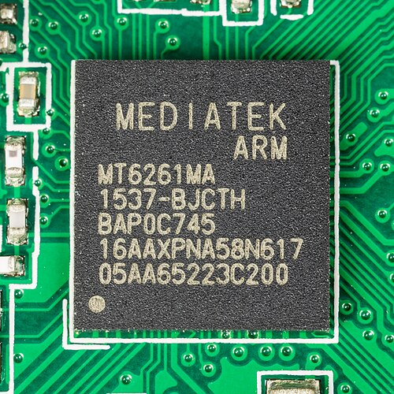

# GFP-105A Jailbreak and Firmware Development

This repository documents the process of gaining low-level control over the Gradiente Neo Flip GFP-105A and provides a foundation for developing custom firmware or a minimal operating system for the device.

It is intended for experimentation, reverse engineering, and bare-metal development on the MediaTek MT6261 platform.

This is not a complete development environment. It is a starting point.

---

## Scope

This project focuses on:

- Understanding the device boot process  
- Reverse engineering firmware structure  
- Flashing custom binaries to NOR memory  
- Executing user-defined code on the device  
- Providing a base for firmware and OS development  

---

## Target Hardware

- Device: Gradiente Neo Flip GFP-105A  
- SoC: MediaTek MT6261  
- CPU Architecture: ARM  
- Storage: NOR Flash  

This is a constrained embedded environment. There is no operating system, no memory protection, and no abstraction layer once execution is under your control.

---

## Visual Reference

### OpenBIOS Prompt


### MT6261 Chip


---

## Warnings

Working at this level carries risk.

- The device can be permanently bricked  
- Invalid firmware images may prevent boot  
- Recovery may require hardware-level access  

Proceed only if you are comfortable working without safety mechanisms.

---

## Boot Process Overview

At a high level, the MT6261 boot process follows this sequence:

1. Internal Boot ROM executes  
2. Firmware is read from NOR flash starting at address `0x00000000`  
3. A header is validated  
4. The payload is copied to RAM  
5. Execution jumps to the defined entry point  

Controlling the contents at the beginning of flash allows full control over execution.

---

## GRH Header

Firmware images for this device begin with a GRH header. This structure is required for the bootloader to accept and execute the image.

### General Structure

```c
struct GRH {
    char magic[4];
    uint32_t length;
    uint32_t load_addr;
    uint32_t entry_point;
    uint32_t checksum;
};
```

### Field Description

- magic: Identifies the image format  
- length: Total size of the firmware image  
- load_addr: RAM destination address  
- entry_point: Execution start address  
- checksum: Integrity validation  

Incorrect values will prevent execution.

---

## Memory Layout

### NOR Flash

- Base address: `0x00000000`  
- Firmware entry location: `0x000000`  

### RAM

- Typical load address: `0x10000000`  

---

## Firmware Execution Flow

1. `[GRH header][payload]` stored in flash  
2. Bootloader validates header  
3. Payload copied to RAM  
4. Execution jumps to entry point  

---

## Writing Custom Firmware

Minimum requirements:

- Valid GRH header  
- ARM binary payload  
- Safe entry point  

### Toolchain

- arm-none-eabi-gcc  
- GNU ld  
- Python (for packing)  

---

## Example Linker Script

```ld
ENTRY(_start)

SECTIONS {
    . = 0x10000000;

    .text : { *(.text*) }
    .data : { *(.data*) }
    .bss  : { *(.bss*)  }
}
```

---

## OpenBIOS Environment

```
ok
```

Allows:

- Memory inspection  
- Low-level execution  
- Hardware testing  

---

## Flashing

```
flash_tool write openphone-stage1-final.bin @0x000000
```

Use with caution.

---

## Development Strategy

1. Achieve stable execution  
2. Implement UART output  
3. Validate memory  
4. Build runtime  
5. Expand functionality  

---

## Contributions

Useful contributions include:

- GRH documentation improvements  
- Memory mapping  
- Peripheral documentation  
- Tooling  

---

## Closing Notes

This project is about understanding and control at the lowest level.
